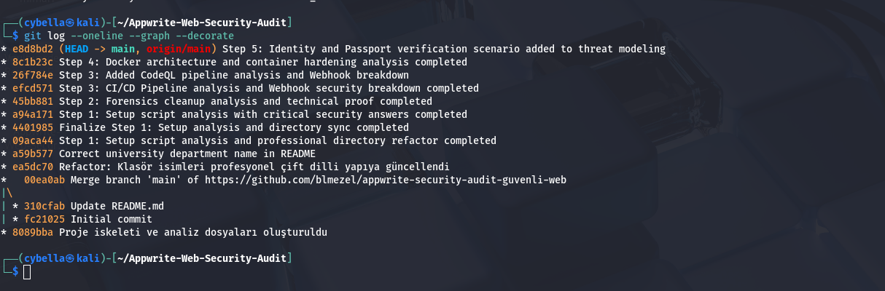

# 🔍 Adım 1: Kurulum ve install.sh Analizi
Appwrite kurulum süreci incelenmiş, scriptin root yetkisi ve Docker socket erişimi gerektirdiği tespit edilmiştir. Bu durum 'Privilege Escalation' riskleri açısından kritik bir denetim noktasıdır.

## 📸 Terminal Kanıtı

