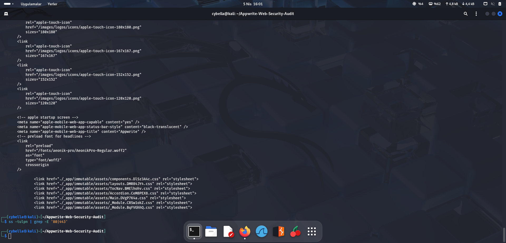

# ⚙️ CI/CD Güvenlik Analizi (CodeQL)
GitHub Actions üzerindeki CodeQL iş akışı analiz edilmiştir. 'permissions: security-events: write' yetkisiyle en az yetki ilkesinin uygulandığı ve SAST taramalarının otomatize edildiği görülmüştür.

## 📸 Terminal Kanıtı

