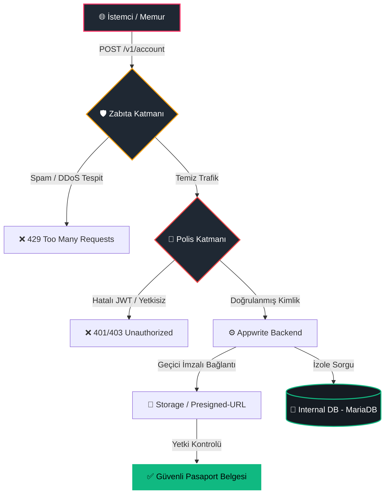

# 📊 E-Pasaport Güvenlik Sistemi Mimari Akış Şeması

Bu şema, pasaport verilerine erişim sırasında uygulanan **"Zabıta ve Polis"** (Rate Limiting & Auth) hiyerarşisini ve veri izolasyonunu teknik olarak özetler.

### 🔍 Şema Açıklaması:
1.  **Zabıta (Edge Security):** Henüz sunucu yorulmadan, saniyedeki istek sayısını denetleyerek Brute-force saldırılarını engeller.
2.  **Polis (Identity Management):** Sadece meşru kullanıcının JWT imzasını ve pasaportu görme yetkisini (ACL) kontrol eder.
3.  **İzolasyon:** Veritabanı dış dünyaya kapalıdır, sadece Backend üzerinden erişilebilir.
